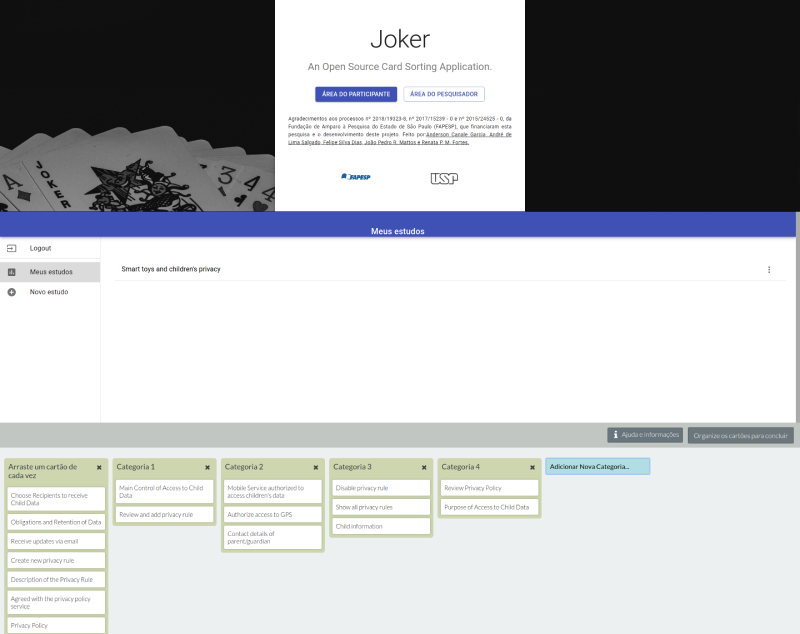
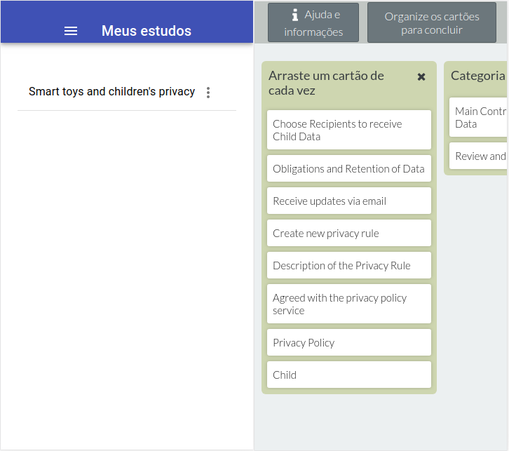
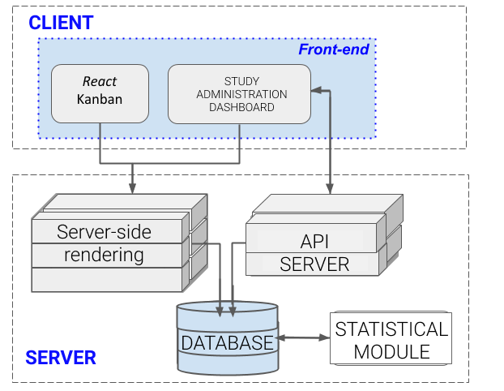

<!-- Description: Scientific Initiation project of HCI (Human-Computer Interface) and IA (Information Architecture) about the relationship of users with software privacy policies -->



# [Joker - An Open Source Card Sorting Application.](http://cafe.intermidia.icmc.usp.br:21337/)


A React app based on [React Kanban](https://github.com/markusenglund/react-kanban) to make use of Card Sorting technique for a Scientific Iniciation project about the relationship of users with software privacy policies.

------------
## Setting-up Joker


|                                 Requirements                                	|
|:---------------------------------------------------------------------------:	|
|                      [Node.js](https://nodejs.org/en/)                      	|
|                     [MongoDB](https://www.mongodb.com/)                     	|
|        [Firebase free account](https://firebase.google.com/?hl=pt-br)       	|
|               [Python 2.7](https://www.python.org/downloads/)               	|
|                [Python 3](https://www.python.org/downloads/)                	|
| Optional Requirements - In case you prefer to run Joker's Docker Version: 	|
|                      [Docker](https://www.docker.com/)                      	|
|              [Docker Compose](https://docs.docker.com/compose/)             	|

## Running the app via Docker (Recommended):
1. Create `.env` files in the `root` and  `/apiResearcher` folders and fill them as shown in the `root .env` and `apiResearcher .env` sections, down below.
2. On the root folder, run `make docker` and wait for the Docker Compose to start all the application services.

## Running the app via Webpack Build
1. Create `.env` files in the `root` and  `/apiResearcher` folders and fill them as shown in the `root .env` and `apiResearcher .env` sections, down below.
3. Run `make install` on the root folder.
4. On other terminal, run `mongod` to start a MongoDB Server.
4. On the first temrinal, go to `/apiResearcher` folder and run `npm run api` to connect our api to the database server.
5. Finally, open other terminal, and run `npm run build:prod` and, after receiving a success message, run on the other one `npm run serve:prod` to start our server side rendering and last part of the application.

## `root .env`
Inside the `.env` file, paste the text below, adding your keys to the corresponding atributes

```
# Admin api
REACT_APP_ADMIN_API=http://localhost:3000

# Home URL
REACT_APP_HOME_URL=http://localhost:1337

# Firebase api configs
REACT_APP_FIREBASE_API_KEY="YOUR FIREBASE API KEY"
REACT_APP_FIREBASE_AUTH_DOMAIN="YOUR FIREBASE AUTH DOMAIN"
REACT_APP_FIREBASE_DATABASE_URL="YOUR FIREBASE DATA URL"
REACT_APP_FIREBASE_PROJECT_ID="YOUR FIREBASE PROJECT ID"
REACT_APP_FIREBASE_STORAGE_BUCKET="YOUR FIREBASE STORAGE BUCKET"
REACT_APP_FIREBASE_MESSAGING_SENDER_ID="YOUR FIREBASE MESSAGING SENDER ID"
```

## `apiResearcher .env`
```
RESULTS_HOST_ADDRESS=http://localhost:3000/
```
------------
## Application Architecture


## Objectives
The overall objective of this project is to improve the usability of interfaces for setting privacy policies on the Web. Therefore, to answer the research question defined in this project, we can list the following 3 objectives:
1. identify and describe the benefits of using online Card Sorting technique for improved usability of interfaces for setting Web privacy policies;
2. identifying necessary adaptations to the online Card Sorting model to enhance their contributions in the area of ​​usable privacy;
3.  developing an online tool for Card application. Sorting

## Research and Publications
The paper [_Smart toys and Children's Privacy: enhancing usability of mobile privacy control tools_](https://doi.org/10.1145/3328020.3353951), sponsored by FAPESP, in  Human-Computer Interaction area of ​​the University of São Paulo (USP), presented at SIGDOC '19 in Portland, Oregon is one of the contribuitions of Joker.


## Credits
- [Anderson Canale Garcia](http://lattes.cnpq.br/6209348707664486)
- [André de Lima Salgado](http://lattes.cnpq.br/9557488934243728)
- [Felipe Silva Dias](http://lattes.cnpq.br/7748732302342787)
- [João Pedro R. Mattos](http://lattes.cnpq.br/9396614149517847)
- [Renata P. M. Fortes](http://lattes.cnpq.br/7082447037374118)
